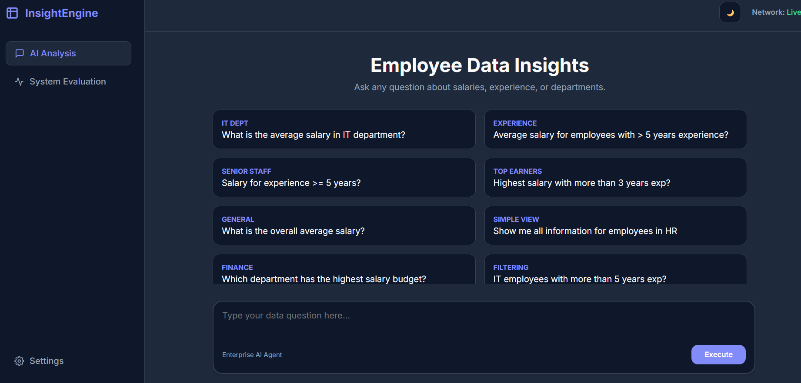
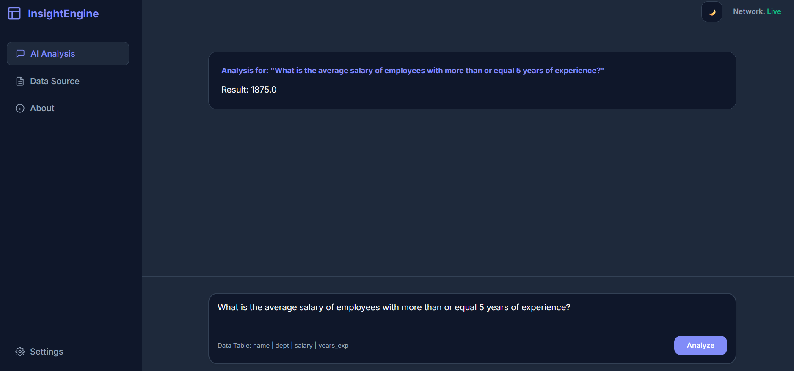
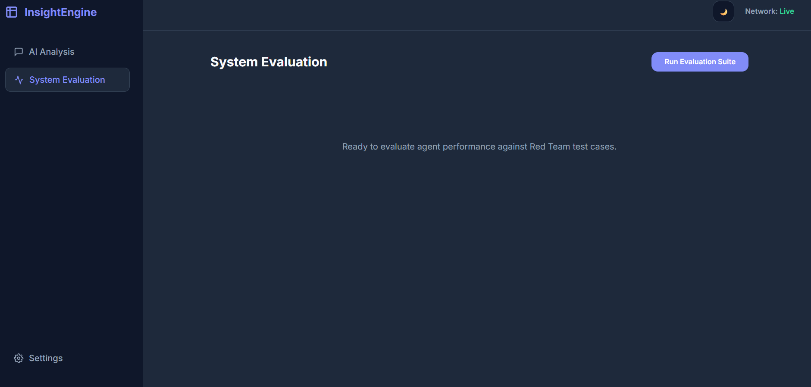
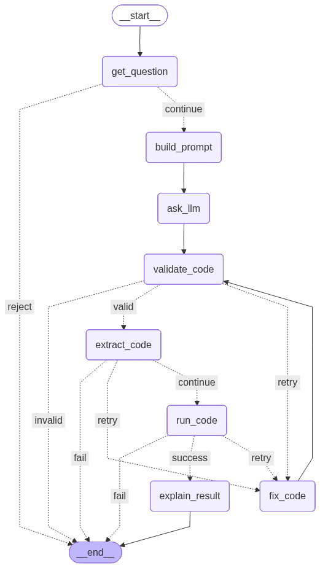

# 🧠 Policy-Aware Self-Correcting Analytics Agent

<p align="center">
  
  
  
  <br/>
  
  
  
  
</p>

---

# 📖 Overview

The **Policy-Aware Self-Correcting Analytics Agent** is an **agentic AI system** that converts natural language questions into **safe executable Pandas analytics**.

Instead of executing model output directly, the system introduces a **policy-aware control loop** that validates, executes, and repairs generated code.

The architecture combines:

- **LangGraph state machines**
- **AST-based security validation**
- **sandboxed execution**
- **automatic code repair**

to enable **secure natural-language data analysis**.

---

# 🖥️ System Interface

<p align="center">
  <br><br>
  <br><br>
  
</p>

The web interface allows users to:

- submit natural language questions
- execute analytics queries
- view computed results instantly

The UI is served through **FastAPI** and communicates with the analytics agent through REST endpoints.

---

# 🏗️ System Architecture

<p align="center">

</p>

The system operates through a **LangGraph state workflow**.

Each node in the graph represents a stage in the analytics pipeline, allowing controlled transitions between:

- code generation
- policy validation
- execution
- retry and repair

---

# 🚀 Core Features

### ⚙️ LangGraph-Based Agent Workflow
A state-driven graph coordinates every step of the analytics lifecycle.

### 🔐 Policy Enforcement Layer
Generated code is inspected using **AST parsing** before execution to prevent unsafe operations.

### ♻️ Self-Correcting Execution
If generated code fails, the agent automatically retries using a **repair prompt**.

### 📊 Secure Data Access
The agent only returns **aggregated analytics results**, preventing exposure of raw datasets.

### 🖥️ Web-Based Interaction
A lightweight **FastAPI dashboard** enables users to interact with the analytics agent in real time.

---

# 🔄 Agent Workflow

Each user request passes through a structured pipeline:

1️⃣ **Question Intake**  
Loads dataset schema and initializes the agent state.

2️⃣ **Code Generation**  
The LLM generates Pandas code to answer the question.

3️⃣ **Code Extraction**  
Markdown formatting and unnecessary text are removed.

4️⃣ **Policy Validation**  
AST checks ensure the code contains no forbidden operations.

5️⃣ **Secure Execution**  
Code runs inside a restricted sandbox environment.

6️⃣ **Retry / Repair**  
If execution fails, error traces are sent back to the model for correction.

---

# 🔒 Security Guardrails

The system enforces strict execution policies to prevent unsafe behavior.

### AST Restrictions

The following Python constructs are blocked:

- `Import`
- `With`
- `ClassDef`
- `FunctionDef`

### Forbidden Runtime Calls

The sandbox prevents operations like:

- `open`
- `eval`
- `__import__`

### Data Privacy Policy

The agent **cannot return entire DataFrames**.

Instead, outputs must be **aggregated analytics**, such as:

- `sum`
- `mean`
- `count`
- `min`
- `max`

---

# 📂 Project Structure

The repository follows a modular structure centered around the `app` package.

```text
├── app
│
│   ├── main.py                     # FastAPI application entry point
│
│   ├── agent
│   │   ├── code_cleaner.py         # Extracts Python code from LLM output
│   │   ├── explain_result.py       # Converts raw outputs into human-readable responses
│   │   ├── llm_client.py           # LLM API client
│   │   ├── policy.py               # Query authorization rules
│   │   ├── prompts.py              # System and repair prompts
│   │   └── retry_logic.py          # Self-correction logic
│
│   ├── api
│   │   ├── schemas.py              # Request and response models
│   │   └── v1
│   │       └── endpoints
│   │           ├── analytics.py    # Main analytics endpoint
│   │           └── analytics_eval.py # Evaluation endpoint
│
│   ├── core
│   │   └── config.py               # Global configuration
│
│   ├── data
│   │   ├── loader.py               # Dataset loading utilities
│   │   └── graph_flow.png          # Graph architecture visualization
│
│   ├── execution
│   │   ├── executor.py             # Code execution controller
│   │   └── sandbox.py              # Restricted execution environment
│
│   ├── graph
│   │   ├── graph_builder.py        # LangGraph construction
│   │   ├── nodes.py                # Agent processing nodes
│   │   ├── edges.py                # Conditional routing logic
│   │   └── state.py                # Agent state definition
│
│   └── web
│       └── index.html              # Frontend dashboard
│
├── data
│   └── employees.csv               # Example dataset
│
├── evaluation
│   ├── metrics.py                  # Evaluation metrics
│   ├── red_team_cases.py           # Adversarial prompts
│   └── run_eval.py                 # Evaluation runner
│
└── scripts
    └── graph_utils.py              # Graph visualization utilities
````

---

# 📊 Evaluation & Red Team Testing

The system includes an evaluation pipeline designed to test robustness against **prompt injection** and **policy violations**.

The `/analytics_eval` endpoint runs predefined adversarial prompts and measures performance across multiple metrics.

| Metric                  | Description                               |
| ----------------------- | ----------------------------------------- |
| **Success Rate**        | Percentage of queries correctly answered  |
| **Rejection Precision** | Accuracy of rejecting malicious prompts   |
| **Repair Rate**         | Ability of the system to fix failing code |

---

# 🛠 Installation

### 1️⃣ Install Dependencies

```bash
pip install -r requirements.txt
```

### 2️⃣ Configure Environment

Create a `.env` file:

```bash
DASHSCOPE_API_KEY=your_api_key_here
```

---

# ▶️ Running the Application

Start the FastAPI server:

```bash
uvicorn app.main:app --reload
```

Open the dashboard:

```
http://127.0.0.1:8000
```

---

# 🎯 Project Goal

This project demonstrates how **LLM-powered analytics systems** can be safely deployed using:

* **policy-aware code generation**
* **graph-based agent orchestration**
* **secure sandbox execution**
* **self-correcting reasoning loops**

to deliver **reliable natural language analytics over structured datasets**.

